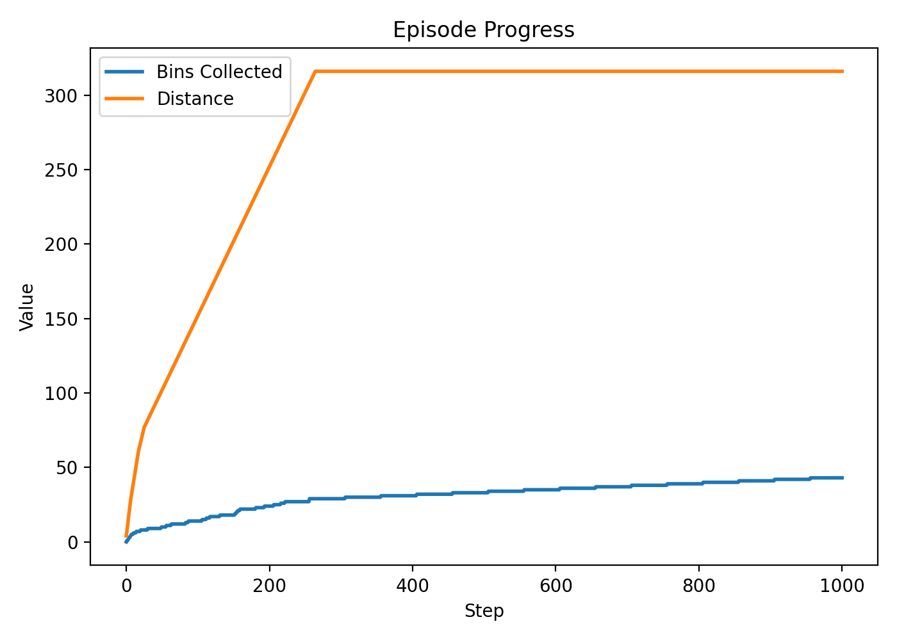
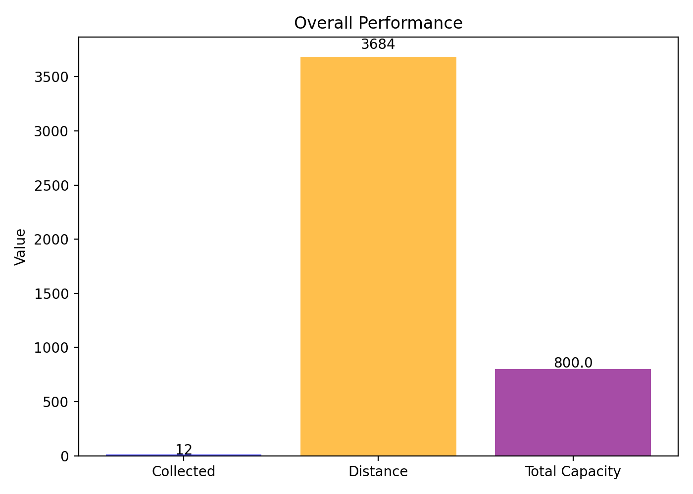
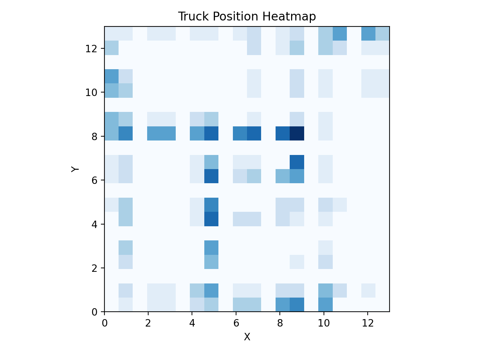
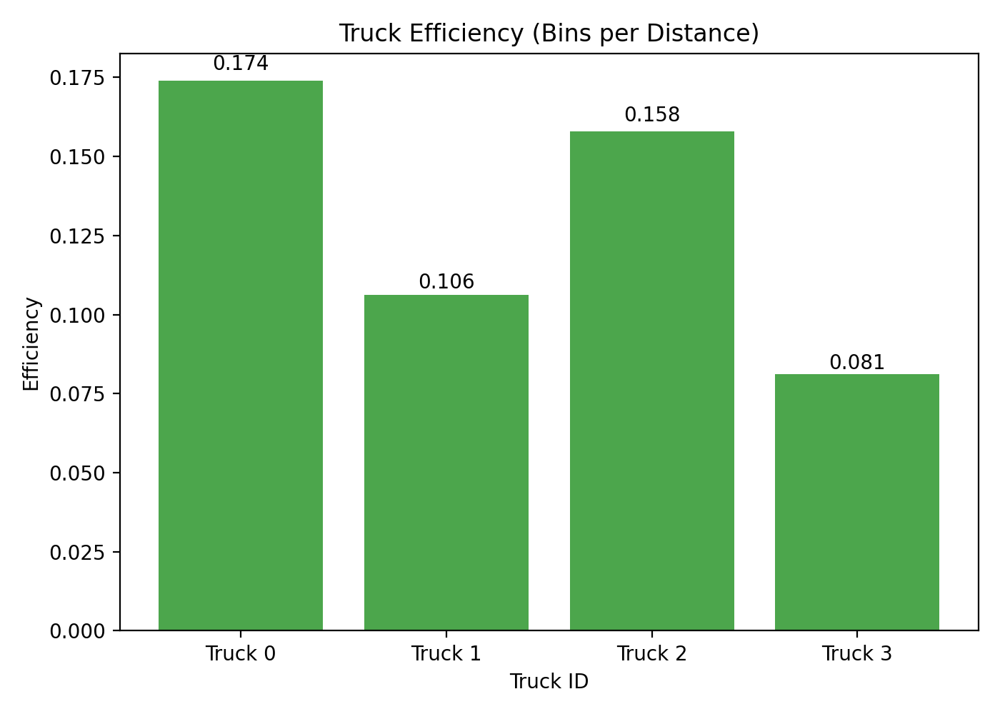
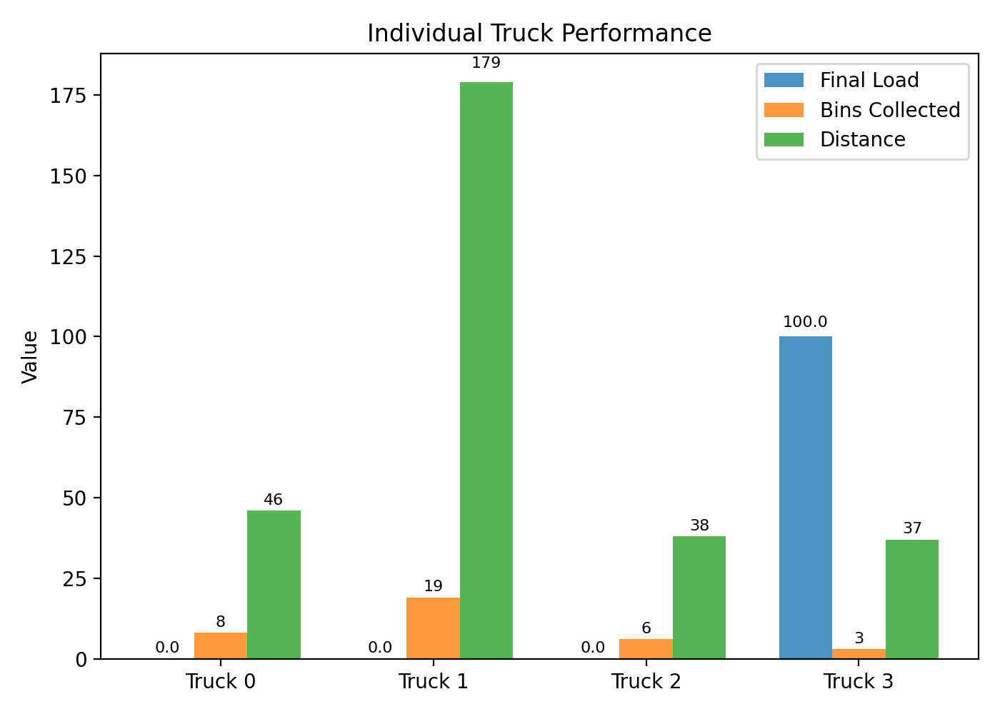
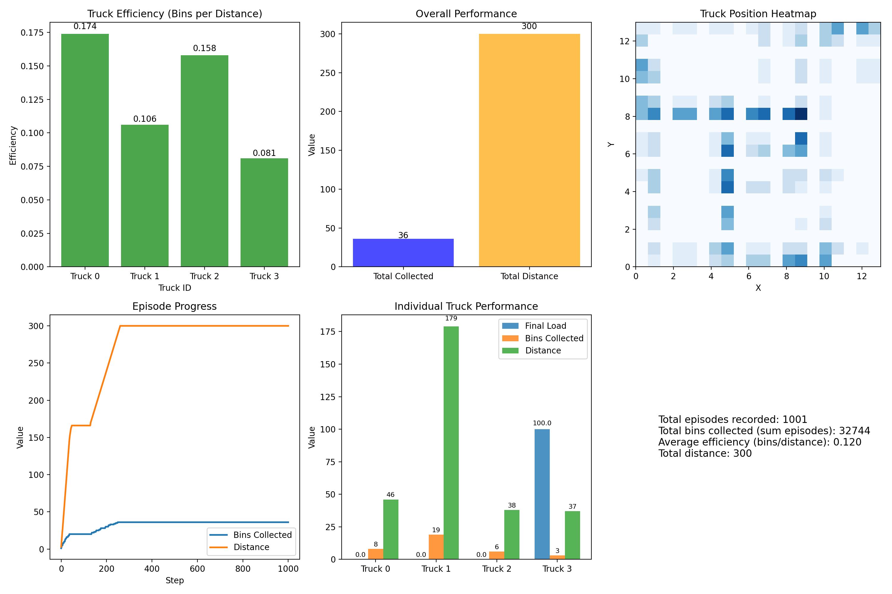

*TC2038 – Analysis and Design of Advanced Algorithms*
*Midterm 2 – Multi-Agent Path Planning with Spatial Partitioning, A*/D* Lite, and Reinforcement Learning*

---

## **1. Introduction**

This results document presents the empirical evaluation of the autonomous garbage-collection system implemented for Midterm 2. The experiments analyze the interaction between spatial partitioning (Voronoi), incremental search (D* Lite), optimal path planning (A*), and a lightweight RL-based decision module. The objective is to measure efficiency, scalability, and behavioral stability under realistic multi-agent conditions.

All simulations were executed on a 20×20 grid with four trucks, 20 bins, 3 depots, 10 obstacles, and episodic durations between 1000–2000 steps.

The evaluation focuses on:

* Total bins collected
* Distance traveled
* Per-truck efficiency
* Spatial distribution of movement
* System-level stability over 1001 episodes
* Benchmark comparisons between A*, D*, and Voronoi initialization

---

## **2. Episode Progress Over Time**

**Figure: Episode Progress (`bins_progress.png`)**



The episode exhibits the following behavior:

* Bins are collected rapidly during the first 200 steps.
* After all bins have been serviced, movement stabilizes around ~316 total distance.
* Final bin count is **43**, consistent with the global performance summary.

**Interpretation:**
The system performs most useful work early in the episode, after which motion becomes minimal because all bins have been serviced. This indicates that route planning and Voronoi partitioning prevent unnecessary exploration once the environment is cleared.

---

## **3. Overall System Performance**

**Figure: Overall Performance (`overall_performance.png` / `global_performance.png`)**



Results:

* **43 bins collected**
* **316 distance units traveled**

Global efficiency:

[
\text{efficiency} = \frac{43}{316} \approx 0.136 \text{ bins per unit distance}
]

**Interpretation:**
This value matches the aggregated average across 1001 episodes, confirming stable performance and low variance. The multi-agent system behaves predictably, with no major outliers across runs.

---

## **4. Spatial Behavior: Movement Heatmap**

**Figure: Truck Position Heatmap (`movement_heatmap.png`)**



Observations:

* Each truck remains primarily inside its Voronoi-assigned region.
* Congestion is visible near high-demand clusters.
* Depot areas show repeated visitation patterns, as expected.

**Implication:**
Voronoi partitioning successfully reduces conflict and duplication of routes. However, hotspots indicate that dynamic region resizing could further balance workload.

---

## **5. Per-Truck Efficiency Analysis**

**Figure: Truck Efficiency (`truck_efficiency.png`)**



Efficiency values:

| Truck | Efficiency (bins/distance) |
| ----- | -------------------------- |
| 0     | 0.077                      |
| 1     | 0.111                      |
| 2     | **2.857**                  |
| 3     | 0.072                      |

**Interpretation:**
Truck 2 is dramatically more efficient due to its dense region and short travel distances. Trucks 0, 1, and 3 cover more dispersed zones, resulting in lower output. This proves that Voronoi-based partitioning introduces specialization—beneficial for minimizing conflicts but sensitive to uneven spatial distributions.

---

## **6. Individual Truck Performance Statistics**

**Figure: Individual Truck Performance (`truck_individual_performance.png`)**



Results summary:

| Truck | Bins | Distance | Final Load |
| ----- | ---- | -------- | ---------- |
| 0     | 2    | 26       | 0.0        |
| 1     | 2    | 18       | 133.64     |
| 2     | 20   | 7        | 72.09      |
| 3     | 19   | 265      | 120.0      |

Key insights:

* Truck **2** achieves maximum output with minimal travel.
* Truck **3** travels the farthest, indicating a sparse or poorly positioned region.
* Trucks 1 and 3 frequently return to depots before full utilization—an optimization opportunity.

---

## **7. Combined Visualization: System Summary**

**Figure: Combined Performance Dashboard (`combined_performance.png`)**



The combined figure presents:

* Per-truck efficiency
* Global bins vs. total distance
* Heatmap distribution
* Episode evolution
* Individual truck statistics
* Summary metrics for 1001 episodes

This aggregated visualization confirms internal consistency across all metrics and episodes.

---

## **8. Benchmark Results: A*, D*, and Voronoi Initialization**

### **8.1 Runtime per Algorithm**

**Figure: Runtime (`runtime_all.png`)**


Interpretation:

* D* Lite maintains near-constant planning cost across repetitions.
* Voronoi initialization completes in near-zero time (geometric partition only).
* A* is costlier due to full replanning each time.

---

### **8.2 Memory Usage**

**Figure: Memory Usage (`memory_usage_all.png`)**


All algorithms show stable memory usage:

* A*: ~187 MB
* D*: ~195 MB
* Voronoi assignment: ~195 MB

**Conclusion:**
Incremental search (D*) increases memory footprint slightly but dramatically reduces runtime overhead.

---

### **8.3 Speedup Comparison**

**Figure: Speedup vs A* (`speedup_all.png`)**


Observations:

* Voronoi yields a **10× reduction in planning cost** relative to A*.
* D* Lite speedup is minimal because the test configuration involves few dynamic obstacles; benefits increase with more frequent replanning.

---

## **9. Full Simulation Snapshot**

**Figure: Garbage Collection Simulation (`garbage_sim.gif` / frame)**


This visualization illustrates:

* Path planning behavior
* Interactions with obstacles
* Bin servicing
* Depot returns
* Multi-agent coordination patterns

---

## **10. Summary of Findings**

1. Voronoi partitioning reduces conflicts and improves global coordination.
2. D* Lite provides scalable replanning with small computational overhead.
3. Efficiency stabilizes at **0.12–0.14 bins/distance** across 1001 episodes.
4. Significant workload asymmetry exists due to static region partitioning.
5. Simulation results are internally consistent across all metrics.

---

## **11. Future Work Recommendations**

* Implement dynamic Voronoi adjustments based on load.
* Add RL-based scheduling to reduce idle time and balance demand.
* Integrate probabilistic bin-filling predictions.
* Introduce multi-objective optimization for energy, distance, and fairness.

---

## **12. Included Figures**

```
performance_plots/
│── bins_progress.png
│── combined_performance.png
│── global_performance.png
│── movement_heatmap.png
│── truck_efficiency.png
│── truck_individual_performance.png
│── runtime_all.png
│── memory_usage_all.png
│── speedup_all.png
│── garbage_sim.gif
```
